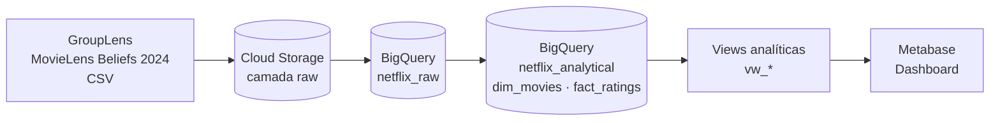
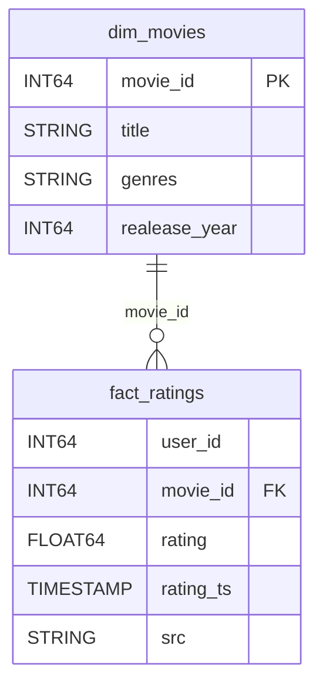
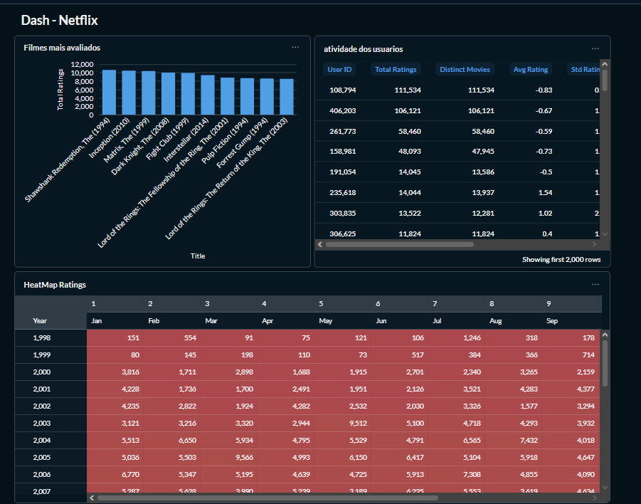
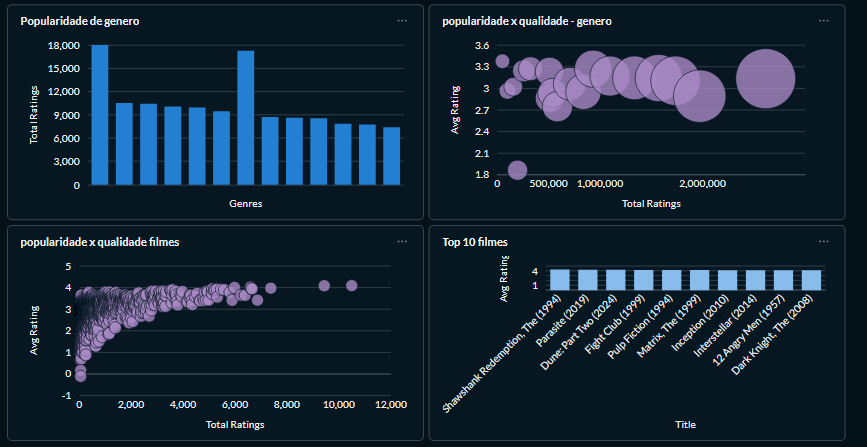

# 🎬 MovieLens Ratings no GCP

Pipeline de engenharia de dados no Google Cloud Platform usando o **MovieLens Beliefs Dataset 2024**: ingestão de arquivos brutos no Cloud Storage, carga e modelagem dimensional no BigQuery e dashboard analítico no Metabase.

## 🎯 Objetivo

Construir, de ponta a ponta, uma solução analítica sobre avaliações de filmes que:

- organize os dados em camadas (**raw → analítica → consumo**);
- aplique **modelagem dimensional** (fato e dimensão) no BigQuery;
- exponha **views** prontas para responder perguntas de negócio;
- entregue um **dashboard** no Metabase com os principais indicadores.

## 🏗️ Arquitetura



| Camada | Serviço | Conteúdo |
|---|---|---|
| Raw (arquivos) | Cloud Storage | CSVs originais do dataset |
| Raw (tabelas) | BigQuery · `netflix_raw` | Tabelas **externas** lendo os CSVs direto do bucket (todas as colunas como `STRING`) |
| Analítica | BigQuery · `netflix_analytical` | Modelo dimensional (`dim_movies`, `fact_ratings`) |
| Consumo | BigQuery · views `vw_*` | Métricas e agregações para o dashboard |
| Visualização | Metabase | Dashboard conectado ao BigQuery via conta de serviço |

### 🔐 Acesso do Metabase ao BigQuery

O Metabase se conecta ao BigQuery por uma **conta de serviço** do GCP, sem usar credenciais pessoais. Para seguir o princípio do menor privilégio, a conta precisa apenas de:

- `BigQuery Data Viewer` (`roles/bigquery.dataViewer`), para ler tabelas e views;
- `BigQuery Job User` (`roles/bigquery.jobUser`), para executar consultas.

> A chave JSON da conta de serviço **não é versionada**: arquivos `*.json` e `.env` estão no `.gitignore`.

## 📦 Fonte dos dados

**MovieLens Beliefs Dataset 2024**, publicado pelo GroupLens Research (University of Minnesota):
<https://grouplens.org/datasets/movielens/ml_belief_2024/>

> ⚠️ **Aviso:** os dados **não são redistribuídos** neste repositório. Arquivos `.csv` e `.zip` estão no `.gitignore`. Para reproduzir o projeto, baixe o dataset diretamente no site do GroupLens e respeite os termos de uso e a licença definidos por eles (incluindo a citação do trabalho original).

Tabelas externas da camada raw (`netflix_raw`), apontando para `gs://<bucket>/bronze/*.csv`:

| Tabela | Descrição |
|---|---|
| `raw_movies` | Catálogo de filmes (título, gêneros) |
| `raw_user_rating_history` | Histórico de avaliações dos usuários |
| `raw_ratings_for_additional_users` | Avaliações de usuários adicionais |
| `raw_user_recommendation_history` | Histórico de recomendações exibidas aos usuários |
| `raw_movie_elicitation_set` | Conjunto de filmes usados na coleta de crenças |
| `raw_belief_data` | Crenças/expectativas dos usuários sobre filmes ainda não avaliados |

## ⭐ Modelo dimensional



- **`dim_movies`** — dimensão de filmes: um registro por filme, com título, gêneros (separados por `|`) e ano de lançamento.
- **`fact_ratings`** — fato de avaliações com granularidade de **uma avaliação por usuário, filme e momento**. A coluna `src` indica a tabela raw de origem da avaliação.

Na passagem da camada raw para a analítica, as colunas `STRING` são convertidas para os tipos corretos (`INT64`, `FLOAT64`, `TIMESTAMP`) com `SAFE_CAST`, e o ano de lançamento é extraído do título via regex — veja [`load_dim_movies.sql`](sql/02_analytical/load_dim_movies.sql).

A [`load_fact_ratings.sql`](sql/02_analytical/load_fact_ratings.sql) une `raw_user_rating_history` e `raw_ratings_for_additional_users` com `UNION ALL`, trata valores vazios e `NA`, aceita timestamps com ou sem fuso horário e descarta linhas incompletas.

> Os DDLs completos estão em [`sql/02_analytical`](sql/02_analytical).

## 📊 Views analíticas

| View | Pergunta que responde |
|---|---|
| `vw_movies_kpis` | Quantas avaliações cada filme recebeu, qual a nota média e o desvio-padrão, e quando foi a primeira e a última avaliação? Serve de base para as outras views. |
| `vw_top_movies` | Quais são os 10 filmes com maior nota média entre os que têm pelo menos 20 avaliações? |
| `vw_genre_performance` | Quais gêneros recebem mais avaliações e quais têm melhor nota média? Filmes com vários gêneros contam em cada um deles. |
| `vw_ratings_heatmap` | Como o volume de avaliações varia por ano e mês? |
| `vw_scatter_popularity_vs_quality` | Os filmes mais populares (com mais avaliações) também são os mais bem avaliados? Considera filmes com 50 ou mais avaliações. |
| `vw_user_activity` | Quantas avaliações e filmes distintos cada usuário tem, qual a nota média dele e em que período esteve ativo? |

> Os SQLs das views estão em [`sql/03_views`](sql/03_views).

## 📈 Dashboard

Dashboard construído no Metabase consumindo as views acima:





| Painel | View |
|---|---|
| Filmes mais avaliados | `vw_movies_kpis` |
| Atividade dos usuários | `vw_user_activity` |
| HeatMap Ratings (ano × mês) | `vw_ratings_heatmap` |
| Popularidade de gênero · Popularidade x qualidade (gênero) | `vw_genre_performance` |
| Popularidade x qualidade (filmes) | `vw_scatter_popularity_vs_quality` |
| Top 10 filmes | `vw_top_movies` |

## 📁 Estrutura do repositório

```
movielens-ratings-gcp/
├── sql/
│   ├── 01_raw/          # DDL das tabelas raw (netflix_raw)
│   ├── 02_analytical/   # DDL e cargas (load_*.sql) do modelo dimensional (netflix_analytical)
│   └── 03_views/        # Views analíticas
├── scripts/
│   ├── extract_ddl.sql  # Consulta ao INFORMATION_SCHEMA
│   └── split_ddl.py     # Gera um .sql por objeto a partir do export
├── images/
│   ├── dashboard.png
│   └── dashboard_2.png
└── README.md
```

> O ID do projeto GCP foi substituído por `seu-projeto-gcp` nos arquivos SQL. Troque pelo seu ao reproduzir.

### Como os SQLs foram extraídos

1. Rodar [`scripts/extract_ddl.sql`](scripts/extract_ddl.sql) no console do BigQuery e salvar o resultado como `ddl_export.csv`.
2. Gerar os arquivos:

   ```bash
   python scripts/split_ddl.py ddl_export.csv --mask-project
   ```

## 🛠️ Tecnologias

- **Google Cloud Storage** — data lake (camada raw)
- **Google BigQuery** — data warehouse, SQL e modelagem dimensional
- **Metabase** — visualização e dashboards
- **SQL** (GoogleSQL / BigQuery)
- **Python** — automação da extração dos DDLs
- **Git & GitHub** — versionamento

## 👤 Autor

**Paulo Rondon Barros**
